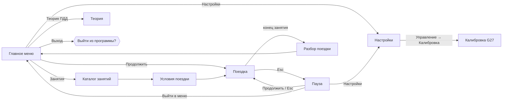

# Меню и настройки — UX-спецификация

Статус: **проект, на согласовании** (24.09.2026). Код по документу не написан.
Макет: `artifacts/visual-review/settings/index.html` — интерактивный HTML, открывается в браузере без сборки.
Связано: T03 (главное меню uGUI/TMP), A03, ADR-006, `docs/architecture.md` §«Ввод, FFB, VR и UI».

HTML-макет — визуальная спецификация, а не Unity UI (ADR-006). Перенос в Unity — через генератор `Code/Editor/UIBuilder.cs`, префабы руками не правим.

## 1. Карта экранов

- «Настройки» — **один экран** для двух точек входа. «Назад» возвращает туда, откуда пришли: в главное меню или в паузу.
- Недоступные функции видны и подписаны бейджем «скоро»; кнопка не изображает работу, которой нет (architecture.md). В главном меню так подписан пункт «Экзаменационный маршрут».

## 2. Навигация и управление

Работает мышью, клавиатурой и кнопками руля G27 (крестовина = стрелки). Фокус виден всегда: золотая полоса слева и подсветка строки.

| Действие | Клавиатура | Поведение |
|---|---|---|
| Пункт вверх/вниз | ↑ ↓ | Фокус по строкам; правая панель показывает описание пункта |
| Изменить значение | ← → | Переключатели «◀ значение ▶» циклические, слайдеры — с шагом |
| Вкладка | Q / E (и Й / У в русской раскладке) | Циклически |
| Сброс пункта | R | Возвращает значение по умолчанию (в черновик) |
| Назад | Esc | Нет изменений → выход; есть → диалог «Сохранить изменения?» |
| Esc в главном меню | Esc | Диалог «Выйти из программы?» — без подтверждения не закрываем (T03) |
| Esc в диалоге | Esc | Безопасный вариант: «Остаться» / «Отмена» / «Вернуть прежний» |

## 3. Модель применения

1. Все правки идут в **черновик**. Изменённая строка помечена точкой, в шапке — «Изменено параметров: N».
2. **Применить** сохраняет черновик и применяет. **Отменить** возвращает сохранённое. **По умолчанию** сбрасывает текущую вкладку в черновик, с подтверждением.
3. Режим экрана и разрешение применяются с **окном подтверждения на 15 с**. Если игрок не нажал «Оставить», прежний режим восстанавливается сам (защита от чёрного экрана).
4. Пункты с флагом «только до поездки» в паузе заблокированы и подписаны «после поездки». Смена КПП или помощников посреди занятия ломает оценку.
5. Пункты руля заблокированы, пока руль (G29) не подключён («нет руля»). Если руль отключили во время поездки, газ = 0, включается пауза, устройство → клавиатура (A04).
6. «Общее качество» — пресет. Ручная правка теней, сглаживания или дальности переключает его в «Своё».

## 4. Список настроек

Статус: **ok** — есть подсистема, можно подключать; **stub** — подсистемы нет, пункт показан с бейджем «скоро», значение сохраняется. Ключи — предложение для файла настроек (§5).

### Графика
| Ключ | Пункт | Значения | По умолчанию | Особенности | Статус |
|---|---|---|---|---|---|
| `graphics.displayMode` | Режим экрана | Полный экран / Окно без рамки / Окно | Полный экран | подтверждение 15 с | ok |
| `graphics.resolution` | Разрешение | список разрешений монитора | 1920×1080 | подтверждение 15 с | ok |
| `graphics.vSync` | Вертикальная синхронизация | вкл/выкл | вкл | блокирует лимит FPS | ok |
| `graphics.fpsLimit` | Ограничение FPS | 30 / 60 / 120 / без ограничения | 60 | не влияет на шаг физики | ok |
| `graphics.qualityPreset` | Общее качество | Низкое / Среднее / Высокое / Своё | Высокое | задаёт 3 пункта ниже | нужен набор URP quality levels |
| `graphics.mirrorQuality` | Качество зеркал | Низкое / Среднее / Высокое | Среднее | разрешение и частота RT в `PlanarMirror` | нужен параметр: сейчас RT жёстко 512×256 |
| `graphics.shadows` | Тени | Выкл / Низкие / Средние / Высокие | по пресету | | ok |
| `graphics.antiAliasing` | Сглаживание | Выкл / FXAA / SMAA / MSAA 4× | по пресету | | ok |
| `graphics.drawDistance` | Дальность прорисовки | 200–1500 м, шаг 50 | по пресету | far clip / LOD | ok |

### Управление
| Ключ | Пункт | Значения | По умолчанию | Особенности | Статус |
|---|---|---|---|---|---|
| `controls.device` | Устройство ввода | Клавиатура / Logitech G27 | Клавиатура | только до поездки; G27 — только если подключён | ok |
| — | Калибровка руля и педалей | кнопка → экран G27Calibration | | нужен руль | ok (экран-макет) |
| `controls.steeringLock` | Угол поворота руля | 180–900°, шаг 10 | 900 | нужен руль | ok |
| `controls.steeringDeadzone` | Мёртвая зона руля | 0–10 % | 0 | нужен руль | ok |
| `controls.steeringLinearity` | Линейность | 0–100 % | 0 | | ok |
| `controls.keyboardSteerSpeed` | Скорость руления с клавиатуры | 20–200 % | 100 | только клавиатура | ok |
| `controls.invertPedals` | Инвертировать педали | вкл/выкл | выкл | нужен руль | ok |
| `controls.pedalDeadzone` | Мёртвая зона педалей | 0–15 % | 3 | нужен руль | ok |
| `controls.ffbStrength` | Сила обратной связи | 0–100 % | 60 | первое включение — малая амплитуда (A05) | **stub** |
| — | Переназначение кнопок | кнопка | | | **stub** |

### Звук (весь раздел — **stub**, звука в проекте нет)
`audio.master` 80, `audio.engine` 80, `audio.environment` 70, `audio.instructor` 100, `audio.ui` 60 (0–100 %, шаг 5); `audio.muteInBackground` — вкл.

### Обучение
| Ключ | Пункт | Значения | По умолчанию | Особенности | Статус |
|---|---|---|---|---|---|
| `gameplay.transmission` | Коробка передач | МКПП / АКПП | МКПП | только до поездки | ждёт солвер (T07–T10) |
| `gameplay.antiStall` | Помощник: двигатель не глохнет | вкл/выкл | выкл | только до поездки; **пишется в результат** (ADR-007) | ждёт солвер |
| `gameplay.autoClutch` | Помощник: автосцепление | вкл/выкл | выкл | то же | ждёт солвер |
| `gameplay.instructorHints` | Подсказки инструктора | Все / Только ошибки / Выкл | Все | на штрафы не влияет | ok |
| `gameplay.subtitles` | Субтитры | вкл/выкл | вкл | | ok |
| `gameplay.defaultCamera` | Камера при старте | Из салона / Сзади | Из салона | вида из салона пока нет (аудит §6) | частично |
| `gameplay.fov` | Угол обзора (FOV) | 50–100° | 75 | тот же ползунок, что в паузе | ok |
| `gameplay.hud` | Показывать HUD | Полный / Минимальный / Выкл | Полный | | ok |
| `gameplay.uiTheme` | Тема интерфейса | Асфальт / Графит / Знак / Бирюза | Асфальт | предпросмотр сразу, сохранение по «Применить»; без него откат (§3, §8) | ok |
| `gameplay.uiScale` | Масштаб интерфейса | 80–130 %, шаг 5 | 100 | множитель CanvasScaler | ok |
| `gameplay.language` | Язык интерфейса | Русский | Русский | | ok |

## 5. Хранение (ADR-016)

- Файл `%USERPROFILE%/AppData/LocalLow/<company>/<product>/settings.json` (`Application.persistentDataPath`), поле `"version": 1`, плоский словарь по ключам из §4. Неизвестные ключи игнорируются, отсутствующие берут значение по умолчанию, значения вне диапазона обрезаются. Битый файл → значения по умолчанию и предупреждение в лог. Игра из-за этого не падает.
- `PlayerPrefs` не используем: реестр Windows, нет версии и не видно в диффе.
- Профиль калибровки G27 хранится отдельно (T04/T05), настройки на него только ссылаются.
- Модель настроек (`GameSettings` + валидация + миграция версий) — чистый C# без UnityEngine, её можно покрыть EditMode-тестами. Применение к `Screen`, `QualitySettings`, URP и камерам — адаптер в `Presentation`.

## 6. Что нужно решить до кода

1. ~~Палитра~~ — **решено 24.09**, см. §8. Осталось поправить токены в T03 и константы `UIBuilder`.
2. ~~Шрифт~~ — **решено 24.09: Golos Text + Roboto Mono** (цифры приборов и таймеров). Образцы и сравнение: `artifacts/visual-review/fonts/index.html`, `fonts.png`. Лицензии проверены по `google/fonts` (METADATA.pb, OFL.txt): все кандидаты — SIL OFL 1.1 с cyrillic и cyrillic-ext; у Barlow Condensed кириллицы нет. В проект класть TTF и `OFL.txt` рядом: `Assets/DrivingSchool/Art/Fonts/GolosText/`, `Assets/DrivingSchool/Art/Fonts/RobotoMono/`. Источники: github.com/googlefonts/golos-text, github.com/googlefonts/robotomono.
3. ~~Где лежит `GameSettings`~~ — **решено: ADR-016**, отдельный чистый модуль `DS.Settings` + `SettingsStore`/`SettingsApplier` в `Presentation`.
4. **Руль — Logitech G29, а не G27** (уточнено владельцем 24.09). Схема кнопок в меню (предложение, номера кнопок сверить в калибровке T04):

| G29 | Меню | Клавиатура |
|---|---|---|
| Крестовина | пункт / значение | ↑ ↓ ← → |
| ✕ | выбрать | Enter |
| ○ | назад | Esc |
| Лепестки ◀ ▶ | вкладка | Q / E |
| △ | сброс пункта | R |
| OPTIONS | пауза / продолжить | Esc в поездке |
| Колесо-селектор + красная кнопка | значение ← → / выбрать | ← → / Enter |

   Шифтер Driving Force Shifter у владельца **есть** (24.09) — H-паттерн 6+R остаётся по R02. CLAUDE.md, requirements.md и architecture.md обновлены; код, тесты и генератор UI — карточка T28.

## 7. Следующие шаги

1. Согласовать макет и §6.
2. T03: главное меню в `UIBuilder` — настоящие `Button`, `InputSystemUIInputModule`, русские тексты, кириллический TMP-шрифт.
3. Карточка T43 «Настройки»: модель и хранение + тесты, затем экран в `UIBuilder` + адаптер применения. Разделы Звук и FFB — со статусом «скоро».

## 8. Цветовые темы

Решено 24.09.2026: по умолчанию **«Асфальт»** — серый фон и жёлтый акцент дорожной разметки. Как дополнительные темы игроку доступны **Графит**, **Знак** и **Бирюза** через пункт `gameplay.uiTheme`. Светлая тема и прежнее золото `prototype.css` отклонены.
Сводный скриншот всех четырёх тем: `artifacts/visual-review/settings/themes.png`. Значения в макете — массив `THEMES` в `index.html`.

| Токен | Назначение | Асфальт | Графит | Знак | Бирюза |
|---|---|---|---|---|---|
| `bg-dark` | фон экрана | `#161718` | `#0F1216` | `#0E1320` | `#0D1414` |
| `bg-panel` | панели, диалоги | `#1E2021` | `#161A20` | `#141B2B` | `#131C1D` |
| `bg-card` | строки, карточки | `#26292B` | `#1C2129` | `#1A2335` | `#192425` |
| `accent` | фокус, выбор, главная кнопка | `#FFD84D` | `#4DA3FF` | `#FFFFFF` | `#2EC4A6` |
| `on-accent` | текст на акценте | `#1A1A1A` | `#08121F` | `#1348A8` | `#04201A` |
| `text` | основной текст | `#F4F4F2` | `#F2F5F8` | `#FFFFFF` | `#EEF6F4` |
| `text-2` | вторичный текст | `#B3B5B6` | `#A9B3C1` | `#B4C0D6` | `#A3B8B4` |
| `muted` | подписи, неактивное | `#6E7173` | `#626C7A` | `#66738C` | `#5E7470` |
| `track` | дорожки слайдеров и переключателей | `#3A3D40` | `#2C333E` | `#2A3550` | `#28393A` |
| `chrome-a` | нижняя панель | `#0F1011` 90 % | `#0A0D10` 88 % | `#1348A8` 92 % | `#091010` 90 % |

Общие для всех тем: `red` `#E5484D`, `green` `#3DBE6B`, линии — белый 8 %.

- **Смысловые цвета от темы не зависят.** Красный — ошибка или штраф, зелёный — «зачтено» или «подключено». Жёлтый у Асфальта — только фокус и выбор, не предупреждение, поэтому предупреждения в HUD нужно выделять ещё и значком.
- **Unity:** тема — `ScriptableObject` с этими токенами. Генератор `UIBuilder` раскрашивает элементы через ссылки на токены, а не через литералы `Color`, чтобы тема менялась в рантайме без пересборки префабов.

